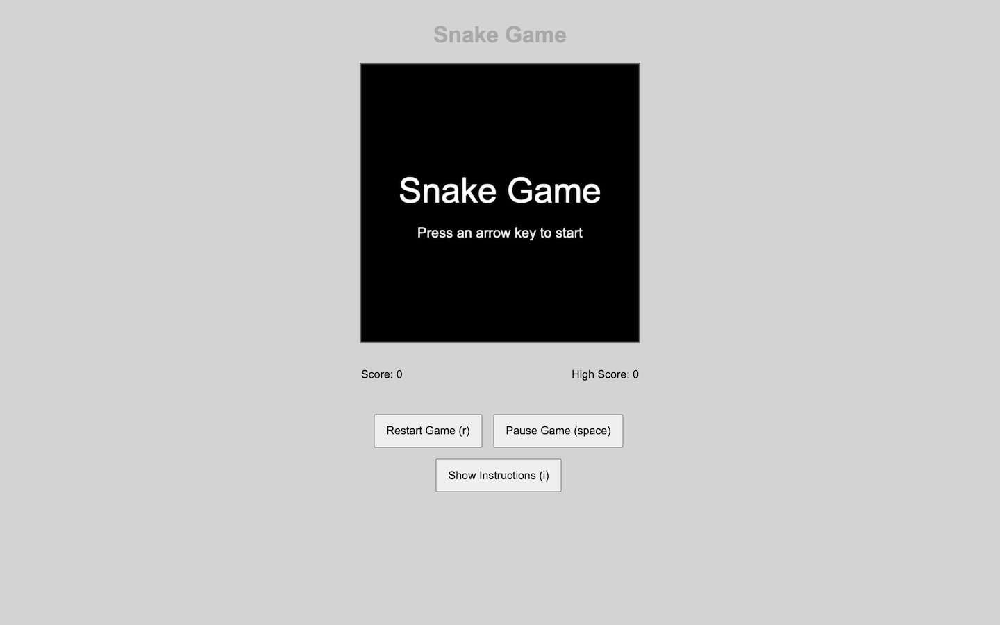

# Minesweeper Game
[](https://github.com/DanyilT/dt-games/releases/tag/minesweeper@v1.0.0)

Test your logic and luck in this classic minesweeper game. Clear the board without hitting any mines.



**[Play in GameHub](https://game-hub.danyt.workers.dev/g/minesweeper)** · [Play directly](https://minesweeper.dt-games.pages.dev) · [Source code](https://github.com/DanyilT/dt-games/tree/minesweeper)

## 🕹️ Controls

| Keys | Action |
| --- | --- |
| Click | Reveal a cell. On a number, reveal the cells around it (when the mines there are flagged) |
| Right-click | Place or remove a flag |
| <kbd>↑</kbd> <kbd>↓</kbd> <kbd>←</kbd> <kbd>→</kbd> / <kbd>W</kbd> <kbd>A</kbd> <kbd>S</kbd> <kbd>D</kbd> | Move the selection |
| <kbd>Space</kbd> / <kbd>Enter</kbd> | Reveal the selected cell |
| <kbd>Shift</kbd> + <kbd>Space</kbd> | Flag the selected cell |
| <kbd>M</kbd> | Switch between reveal and flag mode |
| <kbd>1</kbd> / <kbd>2</kbd> / <kbd>3</kbd> | Difficulty: Beginner / Intermediate / Expert |
| <kbd>R</kbd> | Restart |
| <kbd>I</kbd> | Show or hide the instructions |
| <kbd>Esc</kbd> | Close dialogs |

On a phone or tablet:

- **Tap** a cell to reveal it, or to flag it in flag mode (switch modes with the 🔍/🚩 button).
- **Long-press** a cell to place or remove a flag.

## 💿 Features

- Multiple difficulty levels: Beginner (9×9, 10 mines), Intermediate (16×16, 40 mines) and Expert (30×16, 99 mines)
- Timer and mine counter
- First-click safety: the first cell you open is never a mine
- Flag system, with a flag mode for touch screens
- Wins counted for each level (the ⭐ in the Game menu)
- Classic Windows 9x style
- Mobile-friendly
- Easter Egg

## 💾 Saved data

The game saves everything as one object: `{ "level": "beginner", "wins": { "beginner": 3, "intermediate": 1, "expert": 0 }, "bestTimes": { "beginner": 42, "intermediate": 187, "expert": null } }`.
`level` is the difficulty you picked, `wins` counts your wins on each level (the ⭐ in the Game menu), and `bestTimes` keeps your fastest win on each level, in seconds (`null` until you've won it).
It's kept in the browser, in `localStorage` under `minesweeperGameData`, and in your GameHub account when you play in GameHub signed in (see below).
If the browser blocks storage (some do inside an iframe), the game still plays, but it doesn't remember anything.

## 👾 GameHub

[GameHub](https://game-hub.danyt.workers.dev) plays this game in a frame. `js/gamehub.js` connects the two: it's the same file in every game, loaded before the game's own scripts.

- **Saves:** the game saves only through `window.GameHub`. Every save stays in this browser, as before. When you play in GameHub signed in, your progress also goes to your GameHub account, and the game loads the account's copy, so it follows you from device to device. The first time you play signed in on a device, if your account has no save for this game yet, this device's goes up.
- **The play area:** GameHub asks the game to put its play area in the middle of the frame (the `gamehub:center` message).
- **Offline:** you can download the game in GameHub (the Download button on its page there) to play it offline.
- **The panel and replays:** under the game, GameHub shows what the game tells it with `GameHub.status()` (the score now, your best, and more behind its More button), and each game you finish is kept as a run, so you can watch it again there: the run's random seed and your moves, never a video. The mines are placed from the run's seed (still after your first click, never under it), and each open and flag is recorded with its time. Runs stay in your browser. A cheat (the console, the Easter egg) means that game isn't kept.
- **Checked runs:** signed in, GameHub hands the game a few tickets, each a seed its server chose, and each run takes one. GameHub then plays the run again on its server with this game's rules, so only results it got itself count as your records (it does this offline too, once you're back online). The first board waits for them (`GameHub.ready()`), so it gets one too.
- **Only GameHub:** it loads GameHub's script (`/hub-bridge.js`) only when the game is in a frame on GameHub's own address.

The game works without it: played on its own, or when GameHub can't be reached (the game gives it 3 seconds at most), everything stays in this browser.

## 👀 Links

- **Play in GameHub:** https://game-hub.danyt.workers.dev/g/minesweeper
- **Play directly:** https://minesweeper.dt-games.pages.dev
- **Source code:** https://github.com/DanyilT/dt-games/tree/minesweeper
- **The other games:** [Snake](https://github.com/DanyilT/dt-games/tree/snake), [Tetris](https://github.com/DanyilT/dt-games/tree/tetris) and [Sudoku](https://github.com/DanyilT/dt-games/tree/sudoku), each on its own branch of [DanyilT/dt-games](https://github.com/DanyilT/dt-games)
- **GameHub**, the site with all my games: https://github.com/DanyilT/game-hub
- **Where it came from:** the `minesweeper/` folder of [DanyilT/WebDev](https://github.com/DanyilT/WebDev/tree/page/games/minesweeper), branch `page/games`

## 🔌 Run it locally

It's plain HTML, CSS and JavaScript: no build step, nothing to install. Serve the folder with any static server, for example:

```bash
python3 -m http.server
```

Then open http://localhost:8000.

## 📥 Get just this game

Every game lives on its own branch of [DanyilT/dt-games](https://github.com/DanyilT/dt-games). To clone only this one:

```bash
git clone --branch minesweeper --single-branch https://github.com/DanyilT/dt-games.git minesweeper
```

## 🧻 License

This game is licensed under the [MIT License](LICENSE).
